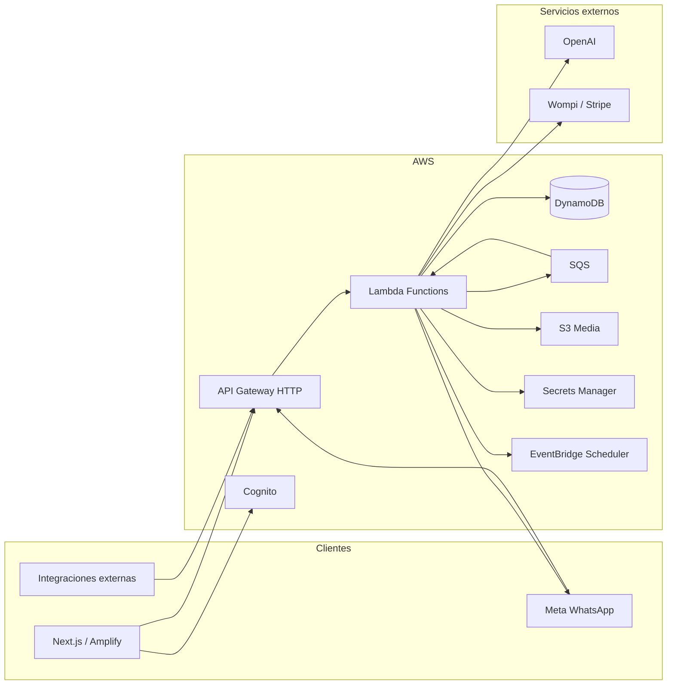

# Integraciones SSH — Plataforma de chatbots WhatsApp

Monorepo serverless para crear, configurar y operar chatbots de WhatsApp Business con respuestas impulsadas por OpenAI, envíos masivos, campañas programadas, API pública y facturación por planes. Incluye panel web (Next.js), backend en AWS Lambda y despliegue de infraestructura con Terraform.

## Características principales

| Área | Descripción |
|------|-------------|
| **Bots** | Configuración por tenant: modo `openai` (prompt, modelo, temperatura) o `webhook` (URL y secreto propios). |
| **WhatsApp** | Webhooks de Meta, Embedded Signup para conectar números y envío de mensajes/plantillas. |
| **Conversaciones** | Historial de mensajes por contacto y métricas de uso. |
| **Plantillas** | CRUD de plantillas aprobadas y envío individual o masivo. |
| **Envío masivo** | Jobs CSV con seguimiento de fallos (`/bulk-send`). |
| **Campañas** | Campañas programadas con inicio, pausa, reanudación y procesamiento vía SQS + EventBridge Scheduler. |
| **API pública** | `POST /v1/messages` con API keys, rate limiting y logs de uso. |
| **Facturación** | Planes `free`, `pro` y `enterprise`; pagos vía **Wompi** y/o **Stripe**. |
| **Multi-tenant** | Aislamiento por tenant en DynamoDB; autenticación con **Amazon Cognito**. |
| **Contactos** | Directorio por teléfono, etiquetas, opt-in/opt-out, importación CSV y exportación. |
| **Compliance** | Bloqueo de envíos masivos/campañas sin opt-in; auditoría de bloqueos. |
| **Inbox operativo** | Estados de conversación (nuevo/abierto/pendiente/resuelto), notas internas y CSAT al cerrar. |
| **Automatizaciones** | Reglas por palabra clave, primer mensaje o programación (texto, plantilla, tags, handoff). |
| **Base de conocimiento (RAG)** | Documentos por bot con embeddings para respuestas contextualizadas. |
| **WhatsApp Flows (Meta)** | CRUD de flows nativos Meta, publicación, envío de prueba y recepción de respuestas (`nfm_reply`). |
| **Flujos visuales** | Constructor no-code con grafo de nodos (mensaje, condición, botones, Meta Flow, handoff, delay). |
| **Webhooks de integración** | Eventos salientes (`message.received`, `conversation.handoff`, `message.sent`, `flow.completed`) vía SQS. |
| **Admin** | Gestión de usuarios Cognito, pagos y tickets de soporte a nivel plataforma. |
| **Legal** | Términos y privacidad con aceptación registrada por tenant. |
| **i18n** | Interfaz en español e inglés. |

## Arquitectura



### Flujo de mensaje entrante

1. Meta envía el evento a `GET/POST /webhook`.
2. La función `webhook` valida la firma y encola el mensaje en SQS.
3. `process-message` consume la cola, aplica límites del plan, genera respuesta (OpenAI o webhook del cliente) y responde por la API de WhatsApp.
4. Se persisten conversación, mensajes y contadores de uso en DynamoDB.

## Stack tecnológico

| Capa | Tecnologías |
|------|-------------|
| **Frontend** | Next.js 15, React 19, Tailwind CSS 4, AWS Amplify UI, TanStack Query, Axios |
| **Backend** | Node.js 20, TypeScript, AWS Lambda, esbuild, Zod, OpenAI SDK, Stripe SDK |
| **Infraestructura** | Terraform ≥ 1.10, AWS (Lambda, API Gateway v2, DynamoDB, SQS, S3, Cognito, Amplify, ACM, Secrets Manager, CloudWatch) |
| **Monorepo** | pnpm workspaces, Husky |
| **CI/CD** | GitHub Actions (`backend`, `frontend`, `terraform`) |

## Estructura del repositorio

```
integracionessh/
├── frontend/              # Panel Next.js (App Router)
├── backend/
│   ├── src/functions/     # Handlers Lambda (una carpeta por función)
│   ├── src/lib/           # Repositorios DynamoDB, WhatsApp, billing, auth, etc.
│   └── scripts/build.js   # Empaqueta todas las funciones en functions.zip
├── infrastructure/
│   ├── modules/           # dynamodb, cognito, lambda, api-gateway, sqs, s3, amplify, monitoring
│   └── environments/      # dev, prod
├── .github/workflows/     # Pipelines de test, build y despliegue
├── pnpm-workspace.yaml
└── package.json
```

## Funciones Lambda

| Función | Rol |
|---------|-----|
| `webhook` | Recibe y valida webhooks de WhatsApp |
| `process-message` | Procesa mensajes entrantes (OpenAI / webhook) |
| `tenants` | CRUD de tenants y perfil legal |
| `bots` | CRUD de bots |
| `conversations` | Lectura de historial |
| `templates` | Plantillas WhatsApp |
| `bulk-send` / `process-bulk-send` | Envío masivo por CSV |
| `campaigns` / `process-campaign` | Campañas programadas |
| `metrics` | Métricas agregadas del dashboard |
| `whatsapp-connect` | Embedded Signup y credenciales |
| `billing` | Checkout, portal y webhooks Wompi/Stripe |
| `api-keys` / `public-api` | Claves API y REST pública |
| `contacts` | Directorio de contactos y compliance |
| `automations` / `process-automation` | Reglas de automatización y ejecución programada |
| `knowledge` / `process-knowledge` | Base de conocimiento RAG por bot |
| `meta-flows` | WhatsApp Flows Meta por bot (CRUD, publish, test-send) |
| `flows` / `process-flow` | Flujos visuales y motor de ejecución por grafo |
| `integrations` / `process-integration` | Webhooks salientes e historial de entregas |
| `support-tickets` / `admin` | Soporte y administración |

## API REST (API Gateway)

Rutas expuestas (resumen). Las rutas autenticadas requieren JWT de Cognito salvo webhooks y API pública.

| Método | Ruta | Descripción |
|--------|------|-------------|
| GET/POST | `/webhook` | Verificación y eventos WhatsApp |
| * | `/tenants`, `/bots`, `/conversations` | Gestión multi-tenant |
| * | `/templates`, `/bulk-send`, `/campaigns` | Mensajería y campañas |
| GET | `/metrics` | Uso y estadísticas |
| GET | `/metrics/marketing` | Embudo de campañas y bulk |
| * | `/contacts` | CRUD contactos, import y export |
| * | `/automations` | CRUD reglas de automatización |
| * | `/flows` | Flujos visuales (constructor no-code) |
| * | `/bots/{botId}/meta-flows` | WhatsApp Flows Meta por bot |
| * | `/bots/{botId}/knowledge` | Documentos RAG por bot |
| * | `/integrations/webhook` | Configuración webhooks salientes |
| POST | `/whatsapp/connect` | Conexión Embedded Signup |
| * | `/billing/*` | Planes y pagos |
| POST | `/v1/messages` | API pública (header `X-API-Key`) |
| * | `/api-keys` | Gestión de claves |
| * | `/support/tickets`, `/admin/*` | Soporte y admin |

Dominio personalizado configurable (ej. `api.integracionessh.lat`) vía módulo `api-gateway/custom-domain.tf`.

## Planes, precios y límites

| Plan | Precio (Wompi) | Mensajes / mes | Modelos IA |
|------|----------------|----------------|------------|
| **Free** | Gratis | 250 | GPT-4o mini |
| **Pro** | $179.900 COP / 30 días | 4.000 | GPT-4o mini |
| **Enterprise** | $749.900 COP / 30 días | 15.000 | GPT-4o mini, GPT-4o, GPT-4 Turbo |

| Recurso | Free | Pro | Enterprise |
|---------|------|-----|------------|
| Bots activos | 1 | 5 | Ilimitado |
| Destinatarios envío masivo / job | 50 | 2.000 | 10.000 |
| Campañas activas | 1 | 5 | Ilimitado |
| API (req/min) | 20 | 60 | 120 |
| API (req/día) | 250 | 5.000 | 50.000 |
| Contactos | 250 | 5.000 | Ilimitado |
| Automatizaciones / bot | 2 | 15 | Ilimitado |
| Automatizaciones programadas | 1 | 5 | Ilimitado |
| Meta Flows / bot | 1 | 5 | Ilimitado |
| Flujos visuales / bot | 1 | 5 | Ilimitado |
| Nodos por flujo visual | 10 | 40 | 100 |
| Documentos RAG / bot | — | 10 | 50 |
| Almacenamiento RAG / bot | — | 25 MB | 100 MB |

Los precios Wompi se configuran en `wompi_amount_pro_cents` y `wompi_amount_enterprise_cents` (Terraform). Los límites se aplican en backend (`backend/src/lib/billing/plan-limits.ts`). Las acciones de envío pueden exigir suscripción activa según el plan.

## Panel web (rutas)

| Ruta | Función |
|------|---------|
| `/login`, `/register` | Autenticación Cognito |
| `/bots`, `/bots/new`, `/bots/[botId]/edit` | Gestión de bots |
| `/contacts` | Contactos y consentimiento |
| `/conversations` | Historial e inbox operativo |
| `/templates` | Plantillas |
| `/bulk-send` | Envío masivo CSV |
| `/campaigns`, `/campaigns/new`, `/campaigns/[id]` | Campañas |
| `/automations` | Reglas de automatización |
| `/flows` | Constructor visual de flujos |
| `/bots/[botId]/meta-flows` | WhatsApp Flows Meta |
| `/metrics` | Dashboard de uso |
| `/developer` | API keys y documentación |
| `/settings` | Tenant, WhatsApp, facturación |
| `/support` | Tickets de soporte |
| `/admin/users`, `/admin/payments`, `/admin/support` | Administración plataforma |
| `/legal/terms`, `/legal/privacy` | Documentos legales |

## Requisitos previos

- Node.js 20+
- [pnpm](https://pnpm.io) 9.x (gestor definido en `packageManager`)
- Cuenta AWS con permisos para desplegar la infraestructura
- App de Meta (WhatsApp Business API) con Embedded Signup configurado
- Claves OpenAI (almacenadas por tenant en Secrets Manager tras el onboarding)
- Opcional: cuentas Wompi y/o Stripe para facturación

## Desarrollo local

### 1. Instalar dependencias

```bash
pnpm install
```

### 2. Backend

```bash
cd backend
pnpm run build          # Genera dist/ y functions.zip
pnpm run type-check
pnpm run test
pnpm run lint
```

### 3. Frontend

Crear `frontend/.env.local`:

```env
NEXT_PUBLIC_API_URL=https://<api-id>.execute-api.us-east-1.amazonaws.com
NEXT_PUBLIC_USER_POOL_ID=<cognito-user-pool-id>
NEXT_PUBLIC_USER_POOL_CLIENT=<cognito-app-client-id>
NEXT_PUBLIC_META_APP_ID=<meta-app-id>
NEXT_PUBLIC_META_EMBEDDED_SIGNUP_CONFIG_ID=<embedded-signup-config-id>
NEXT_PUBLIC_ENV=dev
```

```bash
pnpm --filter frontend dev
```

Abrir [http://localhost:3000](http://localhost:3000).

### 4. Infraestructura (Terraform)

```bash
cp infrastructure/environments/dev/terraform.tfvars.example \
   infrastructure/environments/dev/terraform.tfvars
# Editar terraform.tfvars con tokens, claves Meta, Wompi/Stripe, etc.

cd infrastructure/environments/dev
terraform init
terraform plan
terraform apply
```

Variables principales en `terraform.tfvars.example`:

- `aws_region`, `whatsapp_verify_token`, `meta_app_id`, `meta_app_secret`
- `meta_embedded_signup_config_id`, `lambda_zip_path`
- `wompi_*`, `stripe_*`, `frontend_url`, `api_custom_domain`
- `extra_callback_urls`, `extra_logout_urls`, `extra_allowed_origins` (para Amplify tras el primer apply)

Tras el primer `apply`, usar `terraform output amplify_url` y volver a aplicar con las URLs de OAuth/CORS según `amplify_oauth_followup`.

## Modelo de datos

Una tabla DynamoDB por entorno (`chatbot-platform-{env}`) con patrón single-table:

- Claves `PK` / `SK` y GSI `GSI1`
- TTL habilitado en atributo `ttl`
- Point-in-time recovery en producción

Entidades: tenants, bots, conversaciones, mensajes, plantillas, jobs de bulk-send, campañas, API keys, tickets, métricas de uso, etc.

## CI/CD (GitHub Actions)

| Workflow | Disparadores | Acciones |
|----------|--------------|----------|
| **Backend** | Cambios en `backend/` o `infrastructure/modules/lambda/main.tf` | type-check, tests, lint, build, validación de manifest; deploy de código Lambda a `develop` / `main` |
| **Frontend** | Cambios en `frontend/` | lint, build; despliegue Amplify (rama `develop` / `main`) |
| **Terraform** | Cambios en `infrastructure/` | plan/apply de infraestructura y variables de entorno por entorno (`dev`, `prod`) |

Separación de responsabilidades:

- **Terraform** crea y actualiza recursos AWS (Lambda shell, IAM, API Gateway, env vars). No despliega código de aplicación.
- **Backend** es la única vía de actualización del zip compartido (`functions.zip`) vía `update-function-code`.

Ramas:

- `develop` → entorno de desarrollo
- `main` → producción

Los secrets y variables de repositorio/entorno (`AWS_*`, `AMPLIFY_APP_ID_*`, etc.) deben configurarse en GitHub.

Variables `NEXT_PUBLIC_*` del frontend deben coincidir entre GitHub Actions (workflow **Frontend**, job `lint-build`) y Terraform (`infrastructure/modules/amplify/main.tf`):

| Variable | Uso |
|----------|-----|
| `NEXT_PUBLIC_API_URL` | URL del API Gateway |
| `NEXT_PUBLIC_USER_POOL_ID` | Cognito User Pool |
| `NEXT_PUBLIC_USER_POOL_CLIENT` | Cognito App Client |
| `NEXT_PUBLIC_ENV` | `dev` o `prod` |
| `NEXT_PUBLIC_META_APP_ID` | Meta App ID |
| `NEXT_PUBLIC_META_EMBEDDED_SIGNUP_CONFIG_ID` | Embedded Signup config |

Si difieren, el build de CI puede pasar mientras el deploy en Amplify falla o produce artefactos distintos.

## Scripts útiles

```bash
# Desde la raíz
pnpm --filter chatbot-platform-backend run build
pnpm --filter chatbot-platform-backend run type-check
pnpm --filter frontend run lint
pnpm --filter frontend run build
```

## Licencia

[MIT](LICENSE) — Copyright (c) 2026 Brayan Riano
